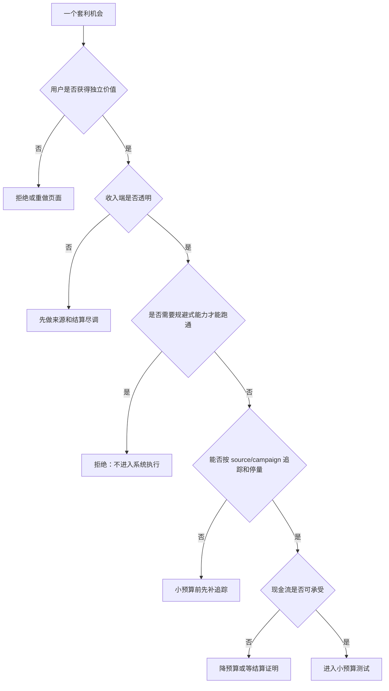

# Ads 套利业务模式拆解手册

更新时间：2026-06-08

本文把常见 Ads 套利模式拆成可判断、可测算、可审计的业务类型。很多团队把“买流量再变现”都叫套利，但不同模式的收入端、风险端、指标和合规要求完全不同。本文只用于行业理解、风控和合规系统设计，不提供桥页、cloaking、无效流量、审核规避、Cookie 后台接管、账号规避或低质流量转售方案。

## 1. 总体分类

| 模式 | 买量端 | 变现端 | 核心公式 | 主要风险 |
| --- | --- | --- | --- | --- |
| 内容/展示广告套利 | Search、Native、Social、Direct buy | AdSense、AdX、GAM、直客展示广告 | Session RPM / 1000 - CPC | MFA、广告密度、无效流量、扣量 |
| 搜索套利 | Search / Native / Content discovery | 搜索 feed、站内搜索广告、搜索结果页广告 | Search click revenue - Traffic cost | 桥页、误导搜索、低质查询、审核风险 |
| 联盟/CPA/CPL 套利 | Google Ads、Bing、Native、Social | Affiliate network、Lead buyer、Advertiser | CVR * Payout - CPC | 拒付、扣量、Offer 限制、lead 质量 |
| 垂直内容站套利 | SEO + Paid + Newsletter | Display + Affiliate + Direct sold | blended revenue - blended acquisition cost | 内容成本、现金流、政策和品牌安全 |
| 域名/parking/feed | Type-in、expired domain、搜索流量 | Parking feed / search ads | RPM / traffic acquisition cost | 低质量流量、商标、误导、政策限制 |
| 流量转售/中转 | 任意便宜流量 | 转卖给下游广告/Offer | resale margin | 来源不透明、无效流量、规避系统 |

第一原则：先判断自己跑的是哪一种模式，再决定看哪些指标。用展示广告套利的 RPM 口径去判断 CPA lead 业务，或用 CPA 的 CVR 口径去判断 AdSense 内容页，都会误导放量。

## 2. 内容/展示广告套利

模式：

```text
Paid traffic -> Content / tool / comparison page -> Ads shown -> Publisher revenue
```

适合页面：

- 指南页。
- 对比页。
- 工具页。
- FAQ / checklist。
- 有持续更新价值的垂类内容。

核心指标：

```text
Session RPM
Page RPM
Ad RPM
Ad impressions / session
Active View viewable rate
Click -> session rate
Finalized revenue
Deduction rate
```

健康条件：

- 页面有独立用户价值，不只是广告容器。
- 广告位不伪装、不诱导、不压过内容。
- 流量来源透明，可按 source 停量。
- RPM 经历过 finalized earnings 和扣量验证。

高风险信号：

- 主要内容很薄，页面主要为展示广告而存在。
- 依赖多页点击、弹窗、sticky、自动播放和高广告密度提高收入。
- 买量来源无法解释，广告请求和收入突然异常。
- 只看 estimated earnings，不看 finalized earnings。

## 3. 搜索套利

模式：

```text
Paid traffic -> Search-like landing / search results page -> Search ads/feed revenue
```

行业里常见话术包括 search arbitrage、feed arbitrage、domain feed、search feed、parking feed。合规与否取决于页面是否真实帮助用户搜索、是否透明展示目的地、是否符合 feed/广告政策，以及用户是否被误导。

核心指标：

```text
Query intent
Search results engagement
Revenue per search
Revenue per paid click
Invalid traffic / low-quality query rate
Advertiser feedback
```

可接受方向：

- 用户明确要搜索或比较某类信息。
- 页面清楚说明搜索/比较结果性质。
- 广告、自然结果、赞助结果有清晰区分。
- 最终目的地和广告承诺一致。

高风险方向：

- 广告把用户带到“看似内容页”，实际只有搜索框或跳转。
- 搜索结果页主要为了触发更多广告点击。
- 用误导标题、倒计时、假按钮诱导用户进入 feed。
- 对审核和普通用户展示不同搜索结果或跳转。
- 买低质流量灌入搜索 feed，导致广告主成本被人为抬高。

系统落地建议：本项目只记录搜索套利的行业原理、指标和风险，不做 feed 接入、搜索结果伪装、自动跳转或搜索广告点击优化。

## 4. 联盟 / CPA / CPL 套利

模式：

```text
Paid click -> Landing page -> Offer click -> Conversion / Lead -> Payout
```

核心指标：

```text
EPC = CVR * Payout
Net EPC = Approved CVR * Payout * (1 - rejection_rate)
Profit per click = Net EPC - CPC
```

关键能力：

- Offer 限制理解：国家、设备、流量来源、brand bidding、incent、native、search、social。
- 追踪：click_id、subid、postback、transaction_id 去重。
- Lead 质量：电话有效、重复率、真实意向、广告主反馈。
- 结算：approved、rejected、paid、deducted、hold。

健康条件：

- 广告承诺、页面和 Offer 一致。
- `subid` 能定位到 source/campaign/creative/device。
- 拒付原因能被解释并映射到流量来源。
- 放量前经历至少一个回传和结算周期。

高风险信号：

- Offer 不说明禁止来源或扣量原因。
- Payout 很高但要求隐藏来源。
- Lead 由低意图或误导承诺驱动。
- 只追求 CVR，不看 approved revenue。

## 5. 垂直内容站套利

模式：

```text
Paid + SEO + Direct audience -> Vertical content / tool site -> Mixed monetization
```

收入端可能包括：

- AdSense / AdX / GAM。
- Affiliate CPA / CPL / CPS。
- 直客 sponsorship。
- Newsletter sponsorship。
- 自有产品或咨询。

这类模式更像“媒体资产”而不是纯流量倒卖。它的特点：

- 内容和品牌可积累。
- 单次买量亏损也可能换来长期 audience。
- 合规要求更高，但抗风险能力更强。
- 需要编辑、产品、SEO、数据、销售和广告运营协作。

核心指标：

```text
Blended CAC
Session RPM
Email capture rate
Returning user rate
Revenue per user
Content production cost
Payback period
```

健康条件：

- 用户能记住站点，而不是只记住广告。
- 页面不是只为广告而做。
- 收入端多元，不依赖单一平台或单一 Offer。
- 有隐私、作者、方法、披露和更新机制。

## 6. 域名 / Parking / Feed 模式

模式：

```text
Type-in / expired domain / residual traffic -> Parking page / search feed -> ad revenue
```

这类模式通常和域名资产、导航流量或搜索 feed 相关。对普通 Google Ads 套利团队来说，风险较高，尤其涉及商标、误导、低质搜索意图、广告主价值和流量来源解释。

风险点：

- 商标或近似域名带来的混淆。
- 页面内容很薄，用户任务不清。
- 流量来源不可解释。
- 变现依赖 feed 质量和严格合作条款。
- 容易和桥页、网关页、低价值库存混在一起。

本系统处理方式：

- 只记录业务模式和风险。
- 不做 feed 接入。
- 不做 parking 页面生成。
- 不做域名批量轮换或账号规避。

## 7. 流量转售和低质中转

模式：

```text
Buy cheap traffic -> Resell / redirect / inflate downstream metrics
```

这是风险最高的一类。它经常伴随：

- 来源不透明。
- 激励点击或自动访问。
- 代理、指纹、设备农场。
- cloaking、分流、Worker 转发。
- 模拟自然用户、补点击、刷展示。
- 为规避扣量不断换账号、换域名、换链接。

本项目不会把这类模式做成能力。它只出现在风险识别、来源尽调、异常指标和高风险专题中。

## 8. 模式选择评分

| 维度 | 低分 | 高分 |
| --- | --- | --- |
| 用户价值 | 只为广告/跳转存在 | 页面或工具本身有价值 |
| 收入透明 | 不知道谁付钱 | 清楚平台、广告主、结算和扣量 |
| 来源透明 | 买包、不可解释 | 可按 source/campaign/placement 停量 |
| 政策风险 | 依赖规避、误导、分流 | 广告承诺和页面一致 |
| 现金流 | 回款慢且扣量不可解释 | approved/paid 稳定 |
| 可扩展 | 靠漏洞或灰色来源 | 靠内容、数据、流程和优化 |
| 系统可落地 | 需要 Cookie/代理/cloaking | 可用导入、导出、审计、任务中心 |

进入测试最低条件：

- 用户价值不低于 70/100。
- 来源透明不低于 70/100。
- 政策风险不能是红线。
- 现金流有安全垫。
- 不依赖高风险能力才能跑通。

## 9. 模式和系统模块映射

| 模式 | 核心模块 | 必看文档 |
| --- | --- | --- |
| 内容/展示广告套利 | Offers、Landing audit、Metrics import、Risk audits | 发布商变现栈、落地页质量、现金流 |
| 搜索套利 | Knowledge / Risk audits only | 高风险研究、链接合规、广告网络滥用 |
| CPA/CPL 套利 | Offers、Calculator、Campaign drafts、Metrics import | Offer 评估、追踪归因、创意优化 |
| 垂直内容站套利 | Offers、Landing audit、Sources、Tasks、Logs | 运营手册、隐私 Consent、账号健康 |
| Parking/feed | Knowledge / Risk audits only | 业务模式拆解、风险矩阵 |
| 低质转售 | Risk audits only | 高风险专题、无效流量专题 |

## 10. 决策树



## 11. 信息来源 URL

- Google Ads policies, Advertising network abuse: https://support.google.com/adspolicy/answer/6008942
- Google Ads policies, Circumventing systems: https://support.google.com/adspolicy/answer/15938075
- Google Ads policies, Destination requirements: https://support.google.com/adspolicy/answer/6368661
- Google AdSense Help, Use of online advertising to get new users to the site: https://support.google.com/adsense/answer/1348722
- Google AdSense Help, Invalid traffic: https://support.google.com/adsense/answer/16737
- Google AdSense Help, Program policies: https://support.google.com/adsense/answer/48182
- Google Publisher Policies: https://support.google.com/publisherpolicies/answer/10437486
- Google Search Central, Spam policies: https://developers.google.com/search/docs/essentials/spam-policies
- Google AdSense Help, Metrics glossary: https://support.google.com/adsense/answer/2735899
- Google Ad Manager Partner Guidelines: https://support.google.com/publisherpolicies/answer/9059370
- IAB UK, A guide to identifying Made for Advertising websites: https://www.iabuk.com/news-article/guide-identifying-made-advertising-websites
- Jounce Media terminology, MFA: https://jouncemedia.com/resources/terminology
