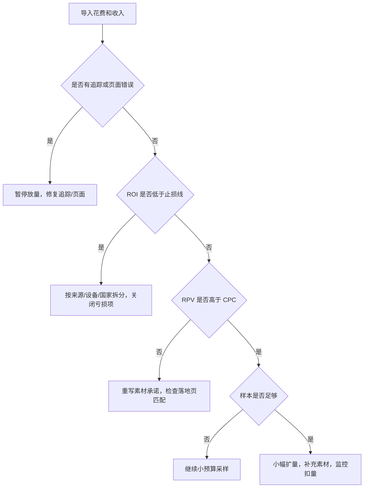

# Ads 套利实战 Playbook

更新时间：2026-06-08

这份 Playbook 是给投放团队日常执行用的。它不替代平台政策，也不鼓励灰黑产操作；它的目标是把 Ads 套利拆成可测算、可复盘、可止损、可审计的业务流程。

## 1. 业务判断框架

每个机会先问 5 个问题：

1. 谁付钱：AdSense/AdX、联盟网络、直客、Lead buyer，还是自有产品？
2. 钱按什么结算：展示、点击、搜索、CPA、CPL、CPS、RevShare？
3. 买来的用户是否真实、有明确意图、来源透明？
4. 页面是否有独立用户价值，而不是只为了展示广告或跳转？
5. 最坏情况是什么：扣量、拒付、账号限制、现金流断裂、合规风险？

如果第 3 或第 4 个问题答不清楚，不建议进入买量测试。

## 2. 利润测算模板

### 2.1 内容/展示广告套利

```text
Session RPM = 每 1000 次会话收入
RPV = Session RPM / 1000
盈亏平衡 CPC = RPV
安全买入 CPC = RPV * 安全系数
```

建议安全系数：

| 阶段 | 安全系数 | 说明 |
| --- | --- | --- |
| 冷启动 | 0.45 - 0.60 | RPM、扣量和页面质量都不稳定 |
| 小样本验证 | 0.60 - 0.75 | 已有 1-3 天数据，但未经历结算周期 |
| 稳定放量 | 0.70 - 0.85 | 有稳定付款、扣量低、来源质量稳定 |

示例：

```text
Session RPM = 120 USD
RPV = 0.12 USD
冷启动可承受 CPC = 0.12 * 0.55 = 0.066 USD
```

### 2.2 CPA/CPL Offer 套利

```text
EPC = CVR * Payout
单点击利润 = EPC - CPC
ROI = (Revenue - Cost) / Cost
```

示例：

```text
Payout = 42 USD
CVR = 1.8%
EPC = 42 * 0.018 = 0.756 USD
买量 CPC = 0.42 USD
单点击毛利 = 0.336 USD
ROI = 80%
```

注意：联盟 Offer 要给扣量、拒付、回款周期和追踪误差留缓冲。

## 3. 机会筛选清单

### 3.1 垂类评分

| 维度 | 低分表现 | 高分表现 |
| --- | --- | --- |
| 商业价值 | 用户没有明确购买/咨询意图 | 高客单价、高 LTV、高广告主竞争 |
| 内容空间 | 很难写出原创内容 | 可做测评、计算器、清单、指南、FAQ |
| 政策风险 | 医疗、金融承诺夸张、误导价格 | 信息型、透明披露、无敏感承诺 |
| 流量成本 | CPC 长期高于 RPV/EPC | 存在长尾词、相邻国家、低竞争角度 |
| 变现稳定 | 单一平台、扣量高 | 多广告需求、多 Offer 备选、付款稳定 |

进入测试的最低标准：

- 总分不低于 70/100。
- 没有单项政策风险高到不可控。
- 至少能写出 5 个真实页面主题，不靠纯桥页。

### 3.2 Offer 评分

| 项目 | 检查点 |
| --- | --- |
| Payout | 是否足以覆盖 CPC、扣量、人工和工具成本 |
| 地区 | 国家是否和页面语言、素材、支付能力匹配 |
| 追踪 | UTM、SubID、S2S postback 是否清晰 |
| 限制 | 是否限制 brand bidding、incent、search、social、native |
| 页面 | 是否可信、移动端可用、信息完整 |
| 结算 | net 7、net 30、预付款、最低付款门槛 |

## 4. 页面建设 SOP

### 4.1 页面类型

优先做：

- 对比页：真实比较功能、价格、适用人群。
- 指南页：帮助用户理解选择标准。
- 工具页：计算器、清单、评分器、模板。
- 测评页：有作者、方法、更新日期和限制说明。
- 本地服务页：明确服务范围、联系方式、隐私说明。

避免做：

- 只有“继续”“查看结果”“热门推荐”的桥页。
- 第一屏广告过多，正文价值很弱。
- 标题承诺和最终页面不一致。
- 伪装成官方、政府、银行、保险公司页面。
- 用倒计时、虚假稀缺、虚假库存刺激点击。

### 4.2 页面上线前检查

| 检查项 | 通过标准 |
| --- | --- |
| 广告承诺一致 | 用户点击广告后第一屏能看到相关内容 |
| 原创信息 | 有独立说明、比较、数据或工具，不只是复制 Offer 文案 |
| 透明度 | About、Contact、Privacy、Terms 可访问 |
| 导航 | 有主页、栏目、返回路径，不是死胡同 |
| 广告标识 | 广告和内容区分明显 |
| 移动端 | 主要内容、CTA、导航不遮挡 |
| 速度 | 首屏可用，不因广告脚本严重阻塞 |
| 跳转 | 最终 URL 稳定，审核和用户链路一致 |

## 5. 买量测试 SOP

### 5.1 最小测试单元

```text
1 个垂类
1 个国家
1 个设备类型
1 个流量平台
2-3 个页面版本
3-5 个创意角度
明确止损预算
```

不要一开始同时测太多变量。否则亏损时不知道该停页面、停素材、停国家，还是停 Offer。

### 5.2 测试预算

用以下方式估算：

```text
最小点击样本 = max(100, 3 / 预估 CVR)
测试预算 = 最小点击样本 * 预估 CPC
硬止损 = 测试预算 * 1.2
```

例：

```text
预估 CVR = 2%
最小点击样本 = max(100, 3 / 0.02) = 150 clicks
预估 CPC = 0.35 USD
测试预算 = 52.50 USD
硬止损 = 63.00 USD
```

### 5.3 测试期间看什么

前 100 点击：

- CPC 是否明显高于预估。
- CTR 是否异常高但页面停留很低。
- 页面是否有加载、跳转、追踪问题。
- 搜索词或来源是否偏离用户意图。

100-300 点击：

- RPV/EPC 是否开始稳定。
- 是否出现转化或广告收入。
- 不同设备/国家/时段是否差异巨大。
- 是否有无效流量、异常跳出、扣量信号。

300 点击以后：

- 是否达到止损或扩量条件。
- 素材是否开始疲劳。
- 页面是否需要拆成更细的意图页。

## 6. 优化决策树



## 7. 素材迭代方法

### 7.1 三类角度

| 角度 | 适合场景 | 风险 |
| --- | --- | --- |
| 问题解决 | 用户痛点清晰，如备份、贷款、保险、软件 | 容易夸大结果 |
| 对比选择 | 高客单价或多品牌比较 | 需要真实信息和清晰披露 |
| 指南清单 | 用户还在研究阶段 | CTR 可能低，但质量更稳 |

### 7.2 素材淘汰规则

可以先用简单规则：

- CTR 低于账号/广告组均值 40%，且样本超过 1000 展示：淘汰。
- CTR 高于均值 2 倍，但 RPV 低于 CPC：改写承诺，避免标题党。
- CPC 连续 2 天上升且 CTR 下降：素材疲劳，补新角度。
- 转化稳定但量小：扩长尾关键词或相邻人群，不直接大幅加预算。

## 8. 链接和追踪规则

每个链接必须记录：

- Offer。
- 当前 URL。
- Tracking URL。
- UTM 或 SubID。
- 候选 URL。
- 轮换原因。
- 审核人。
- 时间。

允许的换链接原因：

- 断链修复。
- UTM 更新。
- 已审核同主题页面 A/B 测试。
- 同 Offer 备用页面切换。
- 联盟平台要求更新跟踪参数。

不允许的换链接原因：

- 审核时给一个页面，真实用户给另一个页面。
- 按地区、设备、Bot 特征展示不同内容。
- 绕过封禁或政策审核。
- 把广告承诺切到不相关 Offer。

## 9. 风控检查表

每日检查：

- 是否有异常点击峰值。
- 是否有低停留、高点击、无收入来源。
- 是否有高 CTR 低 RPV 的素材。
- 是否有页面 404、跳转失败、证书错误。
- 是否有平台 Policy Center、账号限制、扣量通知。

每周检查：

- 账号权限和脚本权限。
- 外部流量供应商质量。
- Offer 限制是否变化。
- 页面广告密度和移动端体验。
- 收入平台扣量比例。

每月检查：

- 完整对账。
- 现金流压力测试。
- 封禁/拒付案例复盘。
- 政策更新复查。
- 停掉长期低毛利业务线。

## 10. 复盘模板

```text
测试名称：
垂类 / Offer：
国家 / 设备：
流量来源：
页面版本：
素材角度：
测试周期：

花费：
点击：
CPC：
收入：
RPV：
利润：
ROI：
转化：
CVR：
扣量/拒付：

结论：
1. 继续 / 暂停 / 扩量 / 重做页面 / 重做素材
2. 哪个变量贡献最大
3. 哪个风险需要处理
4. 下一个测试假设
```

## 11. 团队分工

小团队可以按角色而不是人数拆：

| 角色 | 负责 |
| --- | --- |
| Research | 垂类、Offer、政策、竞品、关键词 |
| Content | 页面、事实核查、披露、更新 |
| Media Buyer | 账号、预算、素材、关键词、出价 |
| Analyst | 指标、归因、ROI、止损、复盘 |
| Ops/Risk | 账号权限、审计、链接、供应商、对账 |

一个人可以兼多角色，但每个角色的检查表不能省。

## 12. 本系统如何承载 Playbook

| Playbook 动作 | 系统模块 |
| --- | --- |
| 记录 Offer、Payout、政策限制 | Offer |
| 测算 RPV/EPC、测试预算、硬止损 | 套利测算 |
| 审计页面质量 | Offer 详情里的落地页采集 |
| 生成素材和关键词 | 创意生成 |
| 组织测试结构 | 投放草稿 |
| 交给投手执行 | CSV / Scripts JSON 导出 |
| 导入结果 | 指标导入 |
| 判断停留或扩量 | 优化建议 |
| 周期复核页面、导出和指标 | 任务中心 |
| 维护 URL | 链接计划 |
| 复盘追溯 | 审计日志 |

## 13. 最后原则

套利不是“便宜流量 + 多广告”这么简单。长期能跑下去的团队，通常不是最会钻漏洞的团队，而是最会算账、最会止损、最会做页面质量、最能保留证据和复盘的团队。

## 14. 信息来源 URL

- Google Ads Help, Advertising network abuse: https://support.google.com/adspolicy/answer/6008942
- Google Ads Help, Destination requirements: https://support.google.com/adspolicy/answer/6368661
- Google Ads Help, About tracking in Google Ads: https://support.google.com/google-ads/answer/6076199
- Google Ads Help, About ValueTrack parameters: https://support.google.com/google-ads/answer/2375447
- Google Analytics Help, Traffic-source dimensions, manual tagging, and auto-tagging: https://support.google.com/analytics/answer/11242870
- Google AdSense Help, If you want to purchase traffic to your site: https://support.google.com/adsense/answer/1348722
- Google AdSense Help, Traffic provider checklist: https://support.google.com/adsense/answer/3332805
- Google AdSense Help, Invalid traffic: https://support.google.com/adsense/answer/16737
