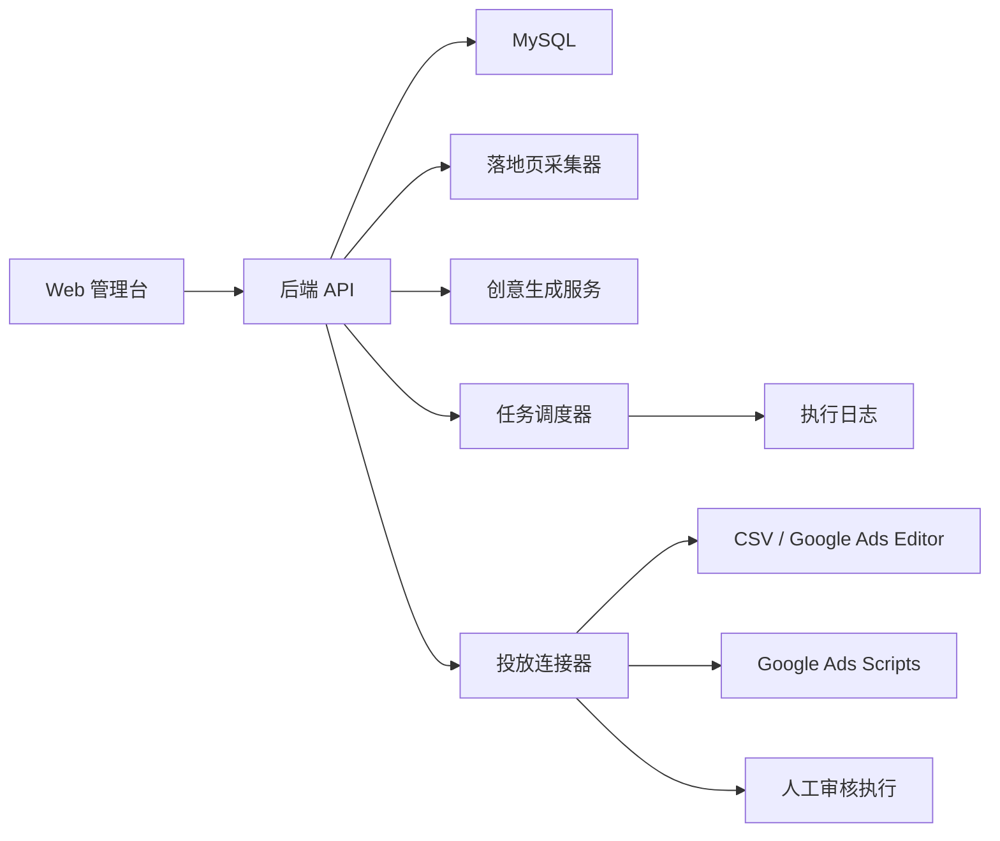

# ADXKit 功能与架构拆解

更新时间：2026-06-09

来源：公开首页 https://adxkit.com/ 。以下内容是基于公开页面文案的产品拆解和合理架构推断，不代表其内部真实实现。

## 1. 公开定位

ADXKit 自称“一站式 Google Ads 广告管理系统”，主打降低人工操作、缩短 Offer 上线时间、批量管理账号、AI 生成创意、落地页采集、数据同步、换链接和任务追踪。

它面向的用户不是普通品牌广告主，而是有多 Offer、多账号、多落地页、多素材测试需求的投放团队。其核心价值叙事是：

- 少登录 Google Ads 后台。
- 快速上 Offer。
- 用 AI 和爬虫减少重复写素材。
- 通过脚本同步数据。
- 通过任务系统追踪换链、点击和执行结果。
- 通过配置化代理、AI 模型、脚本隔离等方式降低运营依赖。

## 2. 页面可见功能清单

| 模块 | 页面描述 | 业务含义 | 本项目处理方式 |
| --- | --- | --- | --- |
| 多账号管理 | MCC/广告账号管理、批量操作 | 投放团队管理多个 Google Ads 账户 | 第一版保留“广告账号配置”，但不做多租户 |
| Google Ads Script 同步 | 15 分钟双向同步，无需 API 审批 | 用 Ads Scripts 代替官方 API 审批流程 | `/scripts-sync` 已实现同步快照、query hash、freshness、Change history、冲突和重拉窗口治理；不写 Cookie 自动化 |
| 广告层级管理 | 账号、广告系列、广告组、关键词、广告 | 批量创建和优化广告结构 | 做投放草稿、关键词、创意、导出；批量变更治理见 [Google Ads Editor CSV 与 Bulk Upload 批量变更治理手册](google_ads_editor_csv_bulk_upload_governance.md) |
| 落地页采集 | 采集标题、描述、用户评价 | 从 Offer 页面提取素材生成输入 | 做页面抓取和质量审计 |
| AI 创意生成 | 3 组广告创意、15 个标题、4 个描述、30+ 关键词 | 降低文案和关键词生产成本 | 做模板化生成，可后续接 LLM |
| 一键提交投放 | 审核后提交 Google Ads | 从草稿到广告账号执行 | 第一版做人工审核和导出，不自动登录后台 |
| 定时任务 | 执行状态、成功失败、日志 | 批量任务编排和可追溯 | 做安全任务中心、手动执行、结果记录和审计日志；详见 [任务编排、安全审批、执行日志与事故复盘手册](task_orchestration_approval_audit_runbook.md) |
| 换链接 | 设置频率、采集最终到达页、更新参数 | 修改跟踪链接或最终 URL | 仅实现合规链接轮换、断链修复、UTM 更新 |
| 补点击 | 模拟自然流量、设置点击数量 | 可能制造无效流量 | 不实现，作为违规风险写入文档 |
| 代理管理 | 多厂商 API、按地区获取 IP | 用于采集或规避风险 | 不实现规避用途；采集仅用普通请求 |
| AI 配置 | 13+ 模型、提示词模板、成本控制 | 多模型创意生成 | 做 Provider 抽象和提示词模板 |
| 防关联设计 | 独立 Script、随机指纹、Worker 转发、隔离 | 规避平台关联检测的叙事 | 不实现规避关联检测 |
| 多租户/权限 | 租户、员工权限、SaaS | 团队协作商业化 | 用户已明确先不要多租户，第一版排除 |

## 3. 推断的业务流程

```text
录入 Offer
-> 采集 Offer/落地页信息
-> AI 生成广告标题、描述、关键词
-> 人工审核创意和政策风险
-> 创建投放草稿
-> 通过 Script/API/人工导入同步到 Google Ads
-> 导入消耗、点击、转化、收入数据
-> 计算利润和异常
-> 生成优化动作：暂停、加预算、换素材、换 URL、修复断链
-> 任务日志沉淀
```

其中高风险分支是：

```text
补点击
代理/IP/指纹
换链绕审核
Cookie 登录后台自动化
```

这些分支不进入本项目实现范围。

## 4. 推断架构



可能的真实 ADXKit 架构还会包含：

- 代理供应商适配器。
- AI 多模型适配器。
- Cloudflare Worker 或中转层。
- 每个 MCC 独立 Script 模板。
- 任务队列和重试机制。
- 多租户和角色权限。

本项目的 V1 去掉多租户和规避检测能力，只保留业务闭环。

## 5. ADXKit 的核心竞争点

### 5.1 效率

一个 Offer 从调研、采集、写文案、配关键词、建广告组到上线，如果全手工做，通常会被重复劳动拖慢。ADXKit 的核心是把“输入 Offer URL 后生成投放草稿”这件事产品化。

### 5.2 批量

套利业务的胜率通常不是靠单个广告，而是靠大量小测试找到少数正 ROI 组合。系统价值在于批量生成、批量测试、批量止损。

### 5.3 可追溯

多账号、多 Offer、多链接、多素材同时跑时，人工表格很容易失控。任务日志、执行记录、链接版本、素材版本能帮助复盘。

### 5.4 风控叙事

ADXKit 页面大量强调账号安全、防关联、代理、脚本隔离。但这部分在合规上很敏感。我们的实现只把它转化为“审计、权限最小化、官方脚本、人工确认、日志保留”，不做绕过平台安全机制的技术。

## 6. 本项目应复刻的核心功能

第一优先级是行业知识和 SOP，因此系统只服务这些动作：

1. Offer 知识库：记录 Payout、国家、垂类、目标 URL、跟踪 URL、政策备注。
2. 单位经济测算：计算 RPV/EPC、break-even CPC、safe CPC、safety margin、test budget 和 hard stop。
3. 页面质量审计：标题、描述、H1、加载状态、链接数量、透明度检查项。
4. 创意生成：按 Offer、页面内容、国家、用户意图生成标题、描述、关键词。
5. 投放草稿：把创意和关键词组织为 Campaign / Ad Group / Ad 的草稿。
6. 指标导入：导入花费、点击、收入、转化，计算 CPC、RPV、ROI。
7. 优化建议：按阈值输出暂停、扩量、换素材、检查页面等建议。
8. 归因增量判断：区分 attributed revenue、incremental revenue、iROAS 和 cannibalization。
9. 订阅 LTV 治理：治理 trial、renewal、refund、chargeback、clawback 和 net LTV。
10. 转化信号质量：治理 primary / secondary、value feedback、offline import、learning status 和出价准入。
11. 决策窗口：治理 data freshness、conversion lag、revenue lag、cohort maturity、stop-loss 和 wait-loss。
12. 合规链接轮换：只允许同主题、已审核、可追踪的 URL 轮换，并记录版本。
13. 来源库：记录 ADXKit 公开页面、Google 政策和技术资料来源 URL。
14. 审计日志：记录每次生成、导入、导出、轮换和建议。

## 7. 高风险能力研究、拆解与安全完成形态

以下能力不是“不研究、不复刻”，而是按两层交付：第一层完整复刻行业知识、原理解释、平台规则、风险识别、审计流程和合规替代方案；第二层不交付会话接管、绕过安全、刷量、cloaking 或规避封禁等执行性对抗能力。

- Ads Cookie 登录和后台操作。
- 自动绕过登录、2FA、安全挑战。
- 补点击、刷展示、模拟自然流量。
- 使用代理、指纹、Worker 转发来规避关联检测。
- cloaking 或审核页/用户页不一致。
- 为规避封禁创建或切换账号。

详细研究见 [高风险能力研究与合规替代方案](high_risk_capability_research.md)，逐点专题和完成矩阵见 [高风险能力专题索引](high_risk/README.md)，来源 URL 见 [Ads 套利研究来源库](source_library.md)。

## 8. 核心能力验收矩阵

这张表用于验收“ADXKit 公开能力是否已经被复刻”。复刻口径不是照搬可能违规的执行动作，而是把公开能力背后的行业原理、运营诉求、系统承接点、文档证据和来源 URL 全部落地；对 Cookie 接管、绕过安全挑战、刷量、cloaking、规避封禁等执行性对抗能力，只交付知识、审计、SOP 和安全替代流程。

| ADXKit 公开能力 | 公开能力和行业原理 | 系统证据 | 文档证据和来源 URL | 不交付边界 |
| --- | --- | --- | --- | --- |
| 多账号 / MCC 管理 | 套利团队需要把账号、付款、主体、权限、预算和 Offer 组合分层治理，但正常协作应基于账号访问级别、付款资料和审计，而不是账号池。 | `/accounts`、`ads_accounts`、`/risk-audits`、`/logs`，V1 为单团队版本，不做多租户。 | [账号、MCC、付款与 Advertiser Verification 治理手册](account_mcc_billing_verification_governance.md)；来源：[ADXKit](https://adxkit.com/)、[Google Ads account access levels](https://support.google.com/google-ads/answer/9978556)、[Circumventing systems](https://support.google.com/adspolicy/answer/15938075)。 | 不交付批量开户、账号池、封禁后换号、付款资料规避或多租户 SaaS。 |
| Google Ads Scripts 同步 / 无 API 审批 | 行业诉求是减少后台手工改动和报表搬运；安全实现应使用授权 Scripts、CSV、Editor 或未来官方 API，而不是复用登录 Cookie。 | `/scripts-sync`、`script_sync_reviews`、`/campaigns/<id>/export.script.json`、`scripts/google_ads_script_payload_preview.js`、`/metrics/import`、`/tasks`、`/logs`。 | [Google Ads Scripts 数据同步、快照与一致性手册](google_ads_scripts_data_sync_consistency.md)、[Google Ads Scripts 安全自动化手册](google_ads_scripts_safe_automation.md)；来源：[Scripts authorization](https://developers.google.com/google-ads/scripts/docs/authorization)、[Preview mode](https://developers.google.com/google-ads/scripts/docs/preview)。 | 不交付 Cookie 后台接管、无人确认写入、绕过 2FA 或安全挑战。 |
| 广告系列、广告组、关键词和广告批量管理 | Google Ads 的执行对象是 campaign / ad group / keyword / ad / asset；套利系统的价值是把 Offer 和创意组织成可审阅草稿。 | `/campaigns`、`campaign_drafts`、CSV 导出、Scripts JSON 导出。 | [Google Ads 投放结构与安全自动化手册](campaign_launch_automation.md)、[Google Ads Editor CSV 与 Bulk Upload 批量变更治理手册](google_ads_editor_csv_bulk_upload_governance.md)；来源：[Prepare a CSV file](https://support.google.com/google-ads/editor/answer/56368)、[Check changes before posting](https://support.google.com/google-ads/editor/answer/56370)。 | 不交付后台 UI 自动点击、越权批量发布或绕审核发布。 |
| 落地页采集和 Offer Intelligence | 套利投放需要从落地页抽取标题、CTA、claim、proof、价格、表单和用户意图，作为创意、关键词、政策审核和页面评分输入。 | `/offers` Offer 详情页、`landing_pages`、`raw_summary`、页面质量评分。 | [落地页素材抽取、Offer Intelligence 与创意 Brief 手册](landing_offer_intelligence_creative_brief.md)、[落地页质量、广告密度与 MFA 风险手册](landing_page_quality_mfa.md)；来源：[Destination requirements](https://support.google.com/adspolicy/answer/6368661)、[Misrepresentation](https://support.google.com/adspolicy/answer/6020955)。 | 不交付登录后采集、代理绕限制采集或绕过 robots/安全控制。 |
| AI 创意生成 | 公开能力强调标题、描述和关键词批量生成；行业核心是 angle、claim、proof、policy review 和人审发布闸门。 | Offer 详情页生成 `creative_sets`，并做 guarantee、official、free、discount、review、scarcity 等风险提示。 | [广告创意生成、测试与优化手册](creative_testing_optimization.md)、[广告创意 Claim 审核与事实核查手册](creative_claim_review_fact_checking.md)、[AI Provider、Prompt 模板与创意成本治理手册](ai_provider_prompt_cost_governance.md)；来源：[Responsive search ads](https://support.google.com/google-ads/answer/7684791)、[Ad strength](https://support.google.com/google-ads/answer/9921843)。 | 不交付虚假 claim、伪官方、伪评价、自动发布或绕过人审。 |
| Source / Publisher / Placement 质量治理 | 套利放量必须先确认来源透明、追踪完整、intent fit、approved/paid revenue、deduction、invalid clicks、complaints、buyer reject、policy issue 和停源控制。 | `/source-quality`、`source_quality_reviews`、`/source-quality/<id>/status`、`/logs`。 | [Source、Publisher、Placement 质量评分与名单治理手册](source_publisher_placement_quality_governance.md)；来源：[AdSense purchased traffic](https://support.google.com/adsense/answer/1348722)、[Google Ads invalid traffic](https://support.google.com/google-ads/answer/11182074)、[Placement exclusions](https://support.google.com/google-ads/answer/7331110)。 | 不交付隐藏来源、补点击、刷展示、模拟自然流量、代理/指纹/Worker 转发或自动改后台 placement。 |
| 流量供应商合同、IO 和争议治理 | 外部买量需要把 IO、tracking/reporting appendix、质量条款、refund/credit/makegood、invoice 和 dispute evidence 接入放量门禁。 | `/vendor-contracts`、`vendor_contract_reviews`、`/vendor-contracts/<id>/status`、`/logs`。 | [流量供应商合同、IO、退款与争议治理手册](traffic_vendor_contract_io_dispute_governance.md)；来源：[IAB Terms](https://www.iab.com/guidelines/general-terms-and-conditions/)、[AdSense traffic provider checklist](https://support.google.com/adsense/answer/3332805)、[ValueTrack](https://support.google.com/google-ads/answer/2375447)。 | 不交付采购不可解释流量、调用供应商 API 灌量、自动扣款、低质 makegood、隐藏来源或模拟流量。 |
| 指标同步、利润分析、优化建议、决策窗口和组合分配 | 套利优化要把 cost、click、conversion、revenue、refund、deduction、lag、cash reserve、revenue status mix 和 concentration exposure 合并到可收款 ROI，并在扩量前确认 data freshness、conversion lag、approval lag、settlement lag、approved/paid revenue 和 source quality。 | `/metrics/import`、Dashboard、`metrics_daily`、`/optimization`、`optimization_actions`、`/decision-windows`、`decision_window_reviews`、`/portfolio-allocation`、`portfolio_allocation_reviews`。 | [单位经济模型、Break-even 与安全边际手册](unit_economics_margin_safety.md)、[决策窗口、回传延迟与收入延迟治理手册](decision_window_revenue_lag_governance.md)、[Portfolio 预算分配、风险集中度与组合治理手册](portfolio_budget_allocation_risk_concentration.md)、[Google Ads Recommendations、Experiments 与 Auto-apply 优化治理手册](google_ads_recommendations_experiments_auto_apply_governance.md)；来源：[Conversion lag reporting](https://support.google.com/google-ads/answer/9347141)、[Data discrepancies](https://support.google.com/google-ads/answer/6165365)。 | 不交付补点击、刷展示、伪造转化、模拟自然流量或污染出价信号；决策窗口和组合分配不自动改预算。 |
| 定时任务和执行日志 | 批量系统需要任务状态、审批、幂等、重试、失败原因和事故复盘；任务系统本身必须拦截危险语义。 | `/tasks`、`task_jobs`、`/logs`、安全任务白名单。 | [任务编排、安全审批、执行日志与事故复盘手册](task_orchestration_approval_audit_runbook.md)；来源：[Scripts execution logs](https://developers.google.com/google-ads/scripts/docs/features/execution-logs)、[Change history](https://support.google.com/google-ads/answer/19888)。 | 不交付验证码处理、2FA 接管、绕过安全挑战、补点击、cloaking 或换号任务。 |
| 换链接 / Final URL 维护 | 正常换链接是同主题、同承诺、已审核候选 URL、参数修复和断链修复；风险点是审核页和用户页不一致。 | `/links`、`link_rules`、候选 URL、人工确认、版本日志。 | [链接计划与换链接合规手册](link_rotation_compliance.md)、[追踪模板、URL 参数与跳转链 QA 手册](tracking_template_redirect_chain_qa.md)；来源：[Destination requirements](https://support.google.com/adspolicy/answer/6368661)、[Circumventing systems](https://support.google.com/adspolicy/answer/15938075)。 | 不交付 Bot 分流、审核页 / 用户页双版本、隐藏真实目的地或违规换链。 |
| 代理、指纹、Worker、防关联叙事 | 这些技术有中性用途，但在广告系统里常被用于隐藏身份、链路或关联资产；可交付部分是风险识别和合法隔离证据。 | `/risk-audits`、`/accounts` 主体备注、来源库和高风险专题。 | [代理、指纹、Worker 转发规避关联检测](high_risk/proxy_fingerprint_worker_association_evasion.md)；来源：[Cloudflare Workers](https://developers.cloudflare.com/workers/)、[EFF Cover Your Tracks](https://coveryourtracks.eff.org/learn)、[Circumventing systems](https://support.google.com/adspolicy/answer/15938075)。 | 不交付代理池、指纹 profile、反检测浏览器、Worker 规避规则或关联检测绕过。 |
| 补点击、刷展示、模拟自然流量 | 公开叙事可能把它包装成“修复自然度”，但广告质量系统把人为抬高成本或收入的点击、展示和访问视为无效流量风险。 | `/metrics/import`、`/optimization`、来源隔离、Click -> Session -> Revenue 对账和风险审计。 | [补点击、刷展示、模拟自然流量](high_risk/invalid_traffic_click_impression_simulation.md)、[无效流量识别、异常监控与来源隔离 SOP](invalid_traffic_detection_sop.md)；来源：[AdSense invalid traffic](https://support.google.com/adsense/answer/16737)、[How Google prevents invalid traffic](https://support.google.com/adsense/answer/1348752)。 | 不交付点击任务、展示任务、自动浏览、Referer 伪造、停留时长或行为路径模拟。 |
| Cookie 登录、自动绕过登录 / 2FA / 安全挑战 | 真实诉求是减少登录摩擦和多人协作，但 Cookie 是会话凭据，2FA 和安全挑战是账号保护机制。 | `/accounts` 同步方式、`/tasks` 人工执行、CSV / Scripts / API 替代、`/logs` 留痕。 | [Ads Cookie 登录和后台操作](high_risk/ads_cookie_backend_operation.md)、[自动绕过登录、2FA、安全挑战](high_risk/automated_login_2fa_challenge_bypass.md)；来源：[MDN Cookies](https://developer.mozilla.org/en-US/docs/Web/HTTP/Guides/Cookies)、[Secure your Google Ads account](https://support.google.com/google-ads/answer/2375456)、[Confirm it is you](https://support.google.com/google-ads/answer/12865189)。 | 不交付 Cookie 获取、注入、复用、浏览器 Profile 托管、验证码处理、2FA 接管或安全挑战绕过。 |
| Cloaking 和封禁后换号继续投放 | 行业诉求通常是绕审核或保持投放连续性；安全完成形态是页面一致性、账号健康、修复证据和申诉流程。 | `/links`、`/accounts`、`/risk-audits`、`/logs`。 | [Cloaking 或审核页/用户页不一致](high_risk/cloaking_review_user_page_mismatch.md)、[为规避封禁创建或切换账号](high_risk/ban_evasion_account_switching.md)；来源：[Google Search spam policies](https://developers.google.com/search/docs/essentials/spam-policies)、[Fix a suspended Google Ads account](https://support.google.com/google-ads/answer/2375414)、[Circumventing systems](https://support.google.com/adspolicy/answer/15938075)。 | 不交付 cloaking 分流、审核后切违规页、批量开号、账号池或封禁后自动换号。 |

验收结论：ADXKit 的核心公开能力已经分别落在系统页面、Markdown 知识库、来源 URL、风险审计和安全替代流程中。高风险能力不是空白排除项，而是按“完整原理解释 + 行业诉求 + 平台规则 + 审计字段 + SOP + 来源 URL + 不交付边界”的方式完成。

## 9. 复刻状态

| ADXKit 功能点 | 当前状态 | 说明 |
| --- | --- | --- |
| Offer/落地页采集 | 已实现 | Offer 管理、页面采集、质量评分 |
| 单位经济、Break-even 与安全边际 | 已实现 V1 并完成知识形态 | `/calculators` 输出 RPV/EPC、break-even CPC、safe CPC、safety margin、test budget 和 hard stop；详见 [单位经济模型、Break-even 与安全边际手册](unit_economics_margin_safety.md) |
| Offer Cap、Payout、状态变更与替代 Offer | 已实现 V1 工作台并完成知识形态 | `/offer-cap-payout` 保存 cap limit/used、payout version、approval/paid/deduction、buyer capacity、replacement offer review、Offer Cap Score、risk_level、recommended_action、blockers、source URLs 和状态流；cap pacing、payout version、paused/expired、replacement offer 和预算联动见 [Offer Cap、Payout、状态变更与替代 Offer 治理手册](offer_cap_payout_status_governance.md) |
| Source、Publisher、Placement 质量评分与名单治理 | 已实现 V1 工作台并完成知识形态 | `/source-quality` 保存 source、publisher、placement、subid、buyer feedback、approved/paid/deduction、invalid clicks、complaints、policy issue、Source Quality Score、recommended_action、blockers、source URLs 和 allowlist/watchlist/quarantine/blocklist 状态流；详见 [Source、Publisher、Placement 质量评分与名单治理手册](source_publisher_placement_quality_governance.md) |
| 流量供应商合同、IO、退款与争议治理 | 已实现 V1 工作台并完成知识形态 | `/vendor-contracts` 保存 vendor、IO、tracking/reporting appendix、质量条款、invoice、disputed amount、refund/credit/makegood、Vendor Contract Score、amount_at_risk、recommended_action、blockers、source URLs 和 preapproved/active_test/dispute_open/suspended/blocked 状态流；详见 [流量供应商合同、IO、退款与争议治理手册](traffic_vendor_contract_io_dispute_governance.md) |
| AI 创意生成 | 已实现 V1 | 当前为规则模板，后续可接 AI Provider |
| Campaign/Ad Group/Keyword 草稿 | 已实现 | 投放草稿、创意选择、Final URL |
| Search Terms、否定词和 Query Mining | 已实现 V1 工作台并完成知识形态 | `/query-mining` 保存 query、keyword、match type、network、device、approved/paid revenue、buyer reject、policy risk、Query Mining Score、negative_match_type、negative_level、recommended_action、blockers、source URLs 和 negative_proposed/promotion_proposed/applied 状态流；详见 [Search Terms、否定词与 Query Mining 治理手册](search_terms_negative_keyword_query_mining.md) |
| CSV / Scripts 导出 | 已实现 | Google Ads Editor CSV、Scripts JSON payload；`/bulk-upload` 已实现 Editor/Bulk Upload 批量变更治理 V1，记录 batch/hash、preview、Editor check、人工审批、Change History、回滚计划、状态流和 `/logs` 证据；Scripts 数据同步、快照和冲突治理见 [Google Ads Scripts 数据同步、快照与一致性手册](google_ads_scripts_data_sync_consistency.md) |
| Google Ads Scripts 数据同步治理 | 已实现 V1 | `/scripts-sync` 记录 Scripts report/search、query hash、source snapshot hash、freshness、row count、data/revenue status、Change history、conflict_status、rerun window、状态流和 `/logs` 证据 |
| Campaign 命名、Labels、UTM/SubID 与维度治理 | 已实现 V1 | `/taxonomy-governance` 记录 campaign/ad group name、labels、UTM、ValueTrack、SubID map、版本 hash、report join gap、PII/敏感属性检查、状态流和 `/logs` 证据 |
| 指标同步和优化 | 已实现 V1 | CSV 指标导入、ROI/RPV/CPC、优化建议 |
| Lead Form 漏斗与资格问题 | 已完成知识和设计形态 | form version、字段用途、qualification fit、disclosure/consent/CTA、mobile UX、buyer feedback 和 Form Funnel Quality Score 见 [Lead Form 漏斗、资格问题与移动端 UX 治理手册](lead_form_funnel_qualification_ux.md) |
| Lead Consent Proof、TrustedForm / Jornaya 与证据链治理 | 已完成知识和设计形态 | consent proof、certificate、LeadID、page snapshot、buyer disclosure、suppression、handoff evidence 和 dispute evidence pack 见 [Lead Consent Proof、TrustedForm / Jornaya 与证据链治理手册](lead_consent_proof_certificate_evidence_governance.md) |
| Lead Buyer 合同与收入口径 | 已完成知识和设计形态 | accepted、qualified、billable、approved、paid、return window、scrub、invoice、payment 和 dispute evidence 见 [Lead Buyer 合同、IO、Accepted / Qualified / Paid 口径治理手册](lead_buyer_contract_io_paid_definition_governance.md) |
| CPL 垂类经济与资格问题 | 已实现 V1 工作台并完成知识形态 | `/cpl-verticals` 保存 insurance、loan/debt、legal、home services、education、healthcare、B2B lead 的 qualification map、reject reason、feedback lag、effective payout、safe CPC、Vertical Fit Score、blockers 和状态流；详见 [CPL 垂类经济、资格问题与 Buyer Acceptance 手册](cpl_vertical_economics_qualification_playbook.md) |
| Insurance、Medicare / ACA 与 Final Expense Lead | 已完成知识和设计形态 | insurance lead、Medicare lead、ACA / Marketplace lead、final expense lead 的 qualification fields、licensed agent/broker、enrollment window、buyer acceptance、reject reason、consent proof、claim review、offline value mapping 和 Insurance Lead Quality Score 见 [Insurance、Medicare / ACA 与 Final Expense Lead 治理手册](insurance_medicare_aca_final_expense_lead_governance.md) |
| Loan、Mortgage、Credit 与 Debt Lead | 已完成知识和设计形态 | personal loan、mortgage/refi、HELOC、credit card、debt relief、credit repair、student loan relief 的 qualification fields、financial disclosure、licensed lender/broker/lead generator、CFPB comparison-shopping、FCRA/ECOA/TILA、HEC/Personalized Ads、buyer acceptance、reject reason、offline value mapping 和 Financial Lead Quality Score 见 [Loan、Mortgage、Credit 与 Debt Lead 治理手册](loan_mortgage_credit_debt_lead_governance.md) |
| Legal Case Intake、Mass Tort 与 Personal Injury Lead | 已完成知识和设计形态 | legal lead、personal injury、mass tort、case intake 的 practice area、jurisdiction、incident date、representation status、attorney/law firm/intake center/lead generator 边界、lawyer advertising、solicitation、confidentiality、retainer signed、case accepted、offline value mapping 和 Legal Lead Quality Score 见 [Legal Case Intake、Mass Tort 与 Personal Injury Lead 治理手册](legal_case_intake_mass_tort_lead_governance.md) |
| Home Services、Solar 与 Local Services Lead | 已完成知识和设计形态 | home services、solar、local services lead 的 service area、contractor license/insurance、dispatch capacity、emergency lead、Google Local Services Ads charged/credit/dispute、booked/showed/quoted/sold/completed、solar savings claim、offline value mapping 和 Home Services Lead Quality Score 见 [Home Services、Solar 与 Local Services Lead 治理手册](home_services_solar_local_services_lead_governance.md) |
| Education、Career Training 与 Student Lead | 已完成知识和设计形态 | education lead、career training、student inquiry 的 program interest、school type、state authorization、accreditation、licensure、transferability、job placement/salary claim、financial aid/student loan、buyer acceptance、enrollment funnel、offline value mapping 和 Education Lead Quality Score 见 [Education、Career Training 与 Student Lead 治理手册](education_career_training_student_lead_governance.md) |
| Healthcare、Medical Appointment 与 Clinic Lead | 已完成知识和设计形态 | healthcare lead、medical appointment、dental、vision、mental health、urgent care、specialist、telehealth、PHI/tracking、health claim、provider eligibility、appointment showed/treated/paid 和 Healthcare Lead Quality Score 见 [Healthcare、Medical Appointment 与 Clinic Lead 治理手册](healthcare_medical_appointment_lead_governance.md) |
| B2B SaaS、Professional Services 与 Demo Lead | 已完成知识和设计形态 | B2B SaaS、professional services、demo request、trial、ICP、firmographic qualification、buyer committee、MQL/SAL/SQL/opportunity/won、PQL、competitor query、software policy 和 B2B Lead Quality Score 见 [B2B SaaS、Professional Services 与 Demo Lead 治理手册](b2b_saas_professional_services_lead_governance.md) |
| Crypto、Investment 与 Trading Lead | 已完成知识和设计形态 | crypto lead、investment lead、trading lead、Google crypto / financial / complex speculative policy、certification、license/registration、risk disclosure、fraud red flag、KYC/funded/paid 和 Crypto / Investment Lead Quality Score 见 [Crypto、Investment 与 Trading Lead 治理手册](crypto_investment_trading_lead_governance.md) |
| Employment、Recruiting 与 Staffing Lead | 已完成知识和设计形态 | employment lead、job applicant、staffing、real job order、HEC / employment targeting、job scam、EEOC recruiting、pay/remote claim、resume privacy、interview/hire/start/paid 和 Employment Lead Quality Score 见 [Employment、Recruiting 与 Staffing Lead 治理手册](employment_recruiting_staffing_lead_governance.md) |
| Gambling、Sweepstakes 与 Sports Betting Lead | 已完成知识和设计形态 | gambling lead、sportsbook、casino、sweepstakes、social casino、Google certification、license/geo、age gate、responsible gambling、bonus terms、KYC/deposit/wager/NGR/paid 和 Gambling Lead Quality Score 见 [Gambling、Sweepstakes 与 Sports Betting Lead 治理手册](gambling_sweepstakes_sports_betting_lead_governance.md) |
| Addiction Treatment、Rehab 与 Behavioral Health Lead | 已完成知识和设计形态 | addiction treatment、rehab、detox、OTP、MAT/MOUD、LegitScript/Google certification、Part 2/HIPAA tracking、patient brokering、admissions/started/paid 和 Addiction Lead Quality Score 见 [Addiction Treatment、Rehab 与 Behavioral Health Lead 治理手册](addiction_treatment_rehab_behavioral_health_lead_governance.md) |
| Government Services、Immigration 与 Public Benefits Lead | 已完成知识和设计形态 | government services、immigration、passport、visa、DMV、vital records、Social Security、tax / IRS、public benefits、government grants、official relationship、certification、fee disclosure、identity data、application filed/issued/paid 和 Government Services Lead Quality Score 见 [Government Services、Immigration 与 Public Benefits Lead 治理手册](government_services_immigration_public_benefits_lead_governance.md) |
| Lead Pricing 与 Payout Negotiation | 已实现 V1 工作台并完成知识形态 | `/lead-pricing` 保存 buyer、vertical、geo、source、exclusivity、headline/unit/proposed payout、floor、accepted/qualified/approved/paid、return/scrub/chargeback、Buyer cap、payment term、quality evidence、source transparency、Lead Pricing Score、effective payout、paid EPC、safe CPC、reserve、blockers 和状态流；raw CPL、qualified CPL、pay-per-call、appointment、CPA、revshare、scrub buffer、floor、tier、cap 和谈价证据见 [Lead Pricing、Payout Negotiation 与结算安全垫治理手册](lead_pricing_payout_negotiation_governance.md) |
| Appointment Lead、Booking、Show Rate 与 No-show | 已实现 V1 工作台并完成知识形态 | `/appointment-leads` 保存预约平台、payout event、request/book/confirm/show/complete/paid 漏斗、cancel/no-show/duplicate/reschedule、calendar capacity、reminder consent、buyer terms、offline conversion mapping、Booking Quality Score、safe CPC、safe appointment spend、blockers 和状态流；appointment state machine、calendar capacity、confirmation、reminder、show rate、cancel/no-show、offline conversion value 见 [Appointment Lead、Booking、Show Rate 与 No-show 治理手册](appointment_lead_booking_show_rate_governance.md) |
| Buyer Capacity、Cap Pacing 与 Dayparting | 已实现 V1 工作台并完成知识形态 | `/buyer-capacity` 保存 buyer hours、timezone、cap limit/used、elapsed day、hourly contact capacity、accepted/qualified/paid、no buyer、missed contact、after-hours、holiday、ad schedule、fallback policy、Capacity Quality Score、projected usage、safe leads、safe media spend、blockers 和状态流；cap pacing、operating hours、holiday calendar、ad schedule、overdelivery、fallback 和 timezone 见 [Buyer Capacity、Cap Pacing 与 Dayparting 治理手册](buyer_capacity_cap_pacing_dayparting_governance.md) |
| 归因、增量性与流量蚕食 | 已实现 V1 工作台并完成知识形态 | `/attribution` 保存 attributed revenue、incremental lift、iROAS、holdout、brand/organic/remarketing/PMax cannibalization、blockers 和状态流；原理见 [归因、增量性与流量蚕食治理手册](attribution_incrementality_cannibalization.md) |
| 订阅、试用、退款、Chargeback 与 LTV | 已完成知识和设计形态 | trial、renewal、refund、chargeback、clawback、cohort LTV 和取消披露见 [订阅、试用、退款、Chargeback 与 LTV 治理手册](subscription_refund_ltv_chargeback_governance.md) |
| 转化信号质量与出价学习 | 已实现 V1 工作台并完成知识形态 | `/conversion-signals` 保存 conversion goal/action、action stage、primary/secondary、recommended primary status、value mode、bid strategy、weekly approved/paid、click ID coverage、offline match rate、duplicate rate、conversion lag、policy/consent、customer data、offline import diagnostics、transaction_id、bid strategy report、Signal Quality Score、bid readiness、expected paid value、safe target CPA、blockers 和状态流；primary/secondary、value feedback、offline import、bid strategy learning 和自动出价准入见 [转化信号质量与出价学习治理手册](conversion_signal_quality_bidding_learning_governance.md) |
| CRM 阶段与 Offline Conversion Value Mapping | 已实现 V1 工作台并完成知识形态 | `/crm-value-mapping` 保存 source system、buyer feedback source、source stage、standard stage、buyer status、conversion action role、primary recommendation、value mode、payout、approved/paid/return rate、transaction_id、import QA、diagnostics、adjustment rule、PII/consent、CRM Mapping Score、recommended upload policy、expected value、blockers 和状态流；CRM stage、buyer feedback、conversion action mapping、value mode、transaction_id、conversion adjustment、import batch QA 和 diagnostics 见 [CRM 阶段、Buyer Feedback 与 Offline Conversion Value Mapping 手册](crm_buyer_feedback_offline_conversion_mapping.md) |
| Ping/Post 与 Lead Buyer Routing | 已实现 V1 工作台并完成知识形态 | `/ping-post-routing` 保存 routing mode、lead type、consent/disclosure、ping field scope、PII、suppression/DNC、cap snapshot、fallback、buyer feedback、buyer counts、pinged/accepted/posted buyers、expected bid、fallback payout、accept/qualified/paid/no-buyer/reject/duplicate/complaint、Routing Quality Score、expected payable value、safe CPL、blockers 和状态流；Ping/Post、buyer auction/waterfall、exclusive/shared/aged lead、cap/no buyer、consent 分享和 buyer feedback 见 [Ping/Post、Lead Buyer Routing 与线索市场治理手册](ping_post_lead_marketplace_buyer_routing.md) |
| Lead Freshness、Aged Lead 与 Recontact Window | 已完成知识和设计形态 | lead freshness、lead age bucket、fresh/same-day/aged/recycled lead、recontact window、consent refresh、suppression、payout tier 和 Freshness Quality Score 见 [Lead Freshness、Aged Lead 与 Recontact Window 治理手册](lead_freshness_aged_recontact_governance.md) |
| Lead 验证、Suppression 与 PII 治理 | 已完成知识和设计形态 | Validation pipeline、suppression/DNC/opt-out、duplicate、PII 最小化、retention/deletion、Lead Validation Score 和 buyer reject 修复见 [Lead 验证、Suppression、去重与 PII 治理手册](lead_validation_suppression_pii_governance.md) |
| Speed-to-Lead 与联系 SLA | 已完成知识和设计形态 | first attempt SLA、contact cadence、call disposition、call center capacity、DNC/opt-out sync、call reporting 和 Contact Quality Score 见 [Speed-to-Lead、联系策略、坐席容量与 SLA 治理手册](speed_to_lead_contact_sla_governance.md) |
| Call Tracking Number Pool、DNI 与电话归因 | 已完成知识和设计形态 | Google forwarding number、DNI、number pool、call log join key、IVR/转接、recording/PII、call conversion mapping 和 Call Attribution Quality Score 见 [Call Tracking Number Pool、DNI 与电话归因治理手册](call_tracking_dni_number_pool_attribution_governance.md) |
| Pay-per-call、Call Buyer Routing 与 Duration Payout | 已完成知识和设计形态 | call buyer、target、routing plan、IVR、buyer cap/hours、duplicate caller、qualified duration、buyer disposition 和 Call Buyer Quality Score 见 [Pay-per-call、Call Buyer Routing 与 Duration Payout 治理手册](pay_per_call_buyer_routing_duration_payout_governance.md) |
| 决策窗口、回传延迟与收入延迟 | 已实现 V1 工作台并完成知识形态 | `/decision-windows` 保存 Decision Window Score、maturity、recommended_action、blockers、source URLs 和状态流；data freshness、conversion lag、revenue lag、cohort maturity、stop-loss/wait-loss 和 budget ramp 见 [决策窗口、回传延迟与收入延迟治理手册](decision_window_revenue_lag_governance.md) |
| 预算节奏、扩量与止损 | 已实现 V1 工作台并完成知识形态 | `/budget-pacing` 保存 current/proposed budget、test budget、hard stop、safe/actual CPC、cash buffer、Budget Pacing Score、risk_level、recommended_action、blockers、source URLs 和状态流；预算阶梯、dayparting、geo/device、bid adjustment 和 stop-loss 见 [预算节奏、扩量与止损手册](budget_pacing_scaling_stoploss.md) |
| Portfolio 预算分配、风险集中度与组合治理 | 已实现 V1 工作台并完成知识形态 | `/portfolio-allocation` 保存 Core/Scale/Test/Explore/Quarantine、monthly_media_budget、proposed_allocation、revenue status mix、集中度、cash_at_risk、Portfolio Allocation Score、risk_level、recommended_action、blockers、source URLs 和状态流；组合预算、相关性风险和退出规则见 [Portfolio 预算分配、风险集中度与组合治理手册](portfolio_budget_allocation_risk_concentration.md) |
| 异常监控、告警和止损队列 | 已实现规则建议版本 | `/optimization` 基于指标生成 pause_check、stop_loss、creative_mismatch、invalid_traffic_review 等动作；告警分级、证据包和事故分诊见 [异常监控、告警、止损队列与事故分诊手册](anomaly_monitoring_alerting_stoploss_incident_triage.md) |
| 任务追踪 | 已实现 V1 | 安全任务中心、手动执行、结果和审计日志；任务分级、审批、幂等和事故复盘见 [任务编排、安全审批、执行日志与事故复盘手册](task_orchestration_approval_audit_runbook.md) |
| 换链接 | 已实现合规版本 | 同主题候选 URL、人工确认轮换、审计日志 |
| 来源和政策知识库 | 已实现 V1 | Markdown 文档、`/sources` 来源库、风险矩阵 |
| 多租户/员工权限 | 不做 V1 | 用户明确先不要多租户 |
| Cookie 登录后台 | 已完成知识和审计形态 | Cookie/会话原理、后台链路、OAuth/Scripts/CSV 替代、账号配置和风险审计；不交付 Cookie 获取、注入、复用或后台 UI 接管 |
| 补点击/模拟自然流量 | 已完成知识和治理形态 | 无效流量原理、信号污染、追踪断点排查、指标治理和来源隔离；不交付点击、展示或自动浏览任务 |
| 代理/指纹/Worker 防关联 | 已完成知识和审计形态 | 代理/指纹/Worker 中性原理、关联图谱、合法隔离边界和风险审计；不交付代理池、指纹 profile 或 Worker 规避规则 |
| Cloaking/审核绕过 | 已完成知识和链接治理形态 | 差异化页面边界、链路一致性、合规链接计划和版本留痕；不交付 Bot 分流或审核页/用户页双版本 |
| 封禁后换账号继续投放 | 已完成知识和恢复流程形态 | 账号图谱、正常多账号管理、修复证据、申诉和账号健康复盘；不交付批量开户、账号池或封禁后自动换号 |

## 10. V1 功能优先级

| 优先级 | 功能 | 原因 |
| --- | --- | --- |
| P0 | 行业知识文档、SOP、指标字典、风险边界 | 用户明确最重视行业知识 |
| P0 | Offer、页面采集、创意生成、投放草稿 | 对应套利日常核心流程 |
| P0 | 指标导入和 ROI 分析 | 没有利润核算就不是套利系统 |
| P1 | 链接轮换计划和审计 | 支持正常维护，不做绕审核 |
| P1 | Google Ads Scripts / CSV 导出 | 替代 Cookie 操作 |
| P2 | AI Provider、多模型配置 | 可后续增强 |
| P2 | 权限、多租户 | 第一版不做 |
