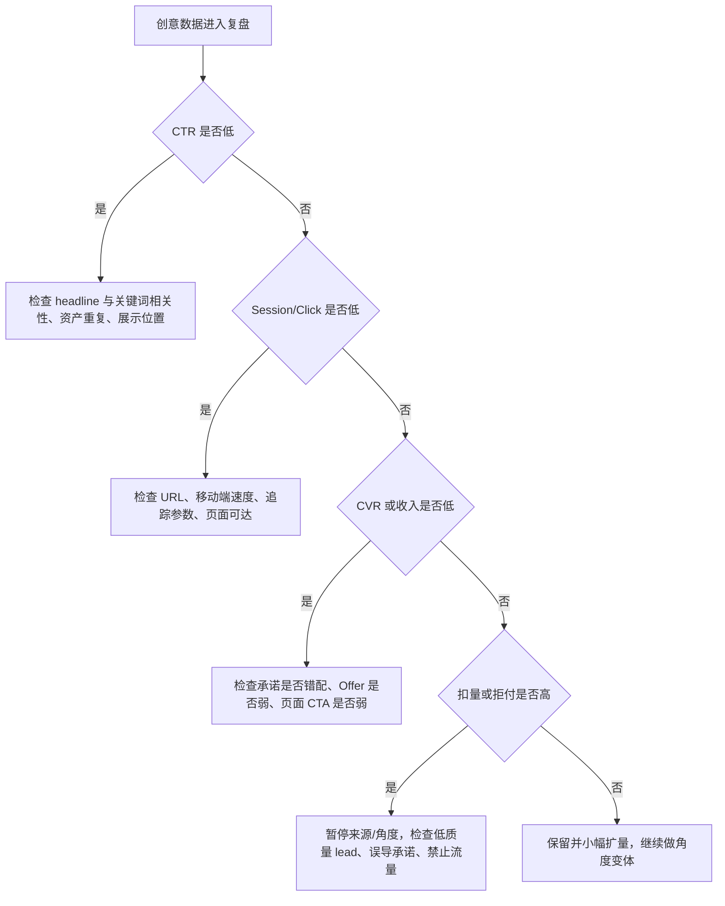

# 广告创意生成、测试与优化手册

更新时间：2026-06-08

本文说明 Ads 套利中广告创意如何从 Offer、关键词、页面证据和用户意图生成，如何测试、优化和审计。本文只覆盖可审核的创意草稿、批量导出和人工确认，不提供 Google Ads 后台 Cookie 接管、绕过审核、违规承诺、自动补点击或伪装投放方案。

## 1. 创意不是文案，而是假设

套利里的每组创意都在验证一个假设：

```text
某类用户意图 + 某个承诺角度 + 某个页面版本 + 某个 Offer
是否能在扣量和现金流后跑出正利润
```

创意要回答四个问题：

1. 用户搜索或浏览时真正想解决什么问题？
2. 页面第一屏是否能兑现广告里的承诺？
3. Offer 是否真的支持这个承诺和国家/设备/流量来源？
4. 这个角度是否会带来高 CTR 但低质量转化或政策风险？

高 CTR 不是最终目标。创意如果靠夸大、误导或制造虚假紧迫感提高点击，短期可能拉高 CTR，长期会带来高跳出、低转化、扣量、拒登和账号风险。

## 2. 创意输入材料

生成创意前必须收集：

| 输入 | 用途 |
| --- | --- |
| Offer 名称、国家、语言、payout、限制 | 防止写出 Offer 不允许的承诺 |
| 落地页标题、H1、核心段落、FAQ | 保证广告承诺和页面一致 |
| 关键词主题和搜索意图 | 保证 headline 与 query 相关 |
| 政策限制 | 避免金融、医疗、博彩、官方身份、误导价格等高风险表达 |
| 竞品/ SERP 观察 | 找到用户常见比较维度，但不能复制 |
| 历史指标 | 识别哪些角度带来高质量收入 |
| 结算/扣量反馈 | 避免继续放大低质量 lead 角度 |

没有页面证据的创意不要上线。例如页面没有价格表，就不要写“查看最低价格”；Offer 不保证批准，就不要写“Guaranteed approval”。

## 3. 创意角度库

| 角度 | 适用场景 | 示例表达方向 | 风险 |
| --- | --- | --- | --- |
| 问题解决 | 用户有明确痛点 | “Compare backup options for small teams” | 不要承诺一定解决 |
| 对比选择 | 多产品、多服务比较 | “See features, pricing, and fit” | 需要真实比较，不做假排名 |
| 计算/估算 | 税费、保险、成本、ROI | “Estimate monthly storage cost” | 估算需说明限制 |
| 资格/匹配 | 教育、金融、本地服务 | “Check available programs in your state” | 避免暗示 guaranteed approval |
| 清单/指南 | 用户在研究阶段 | “What to check before choosing...” | 不要做桥页 |
| 节省/优惠 | 有真实折扣或成本差异 | “Compare plans before you buy” | 没有证据时不要写折扣 |
| 安全/信任 | 工具、B2B、服务 | “Review backup and security features” | 避免虚假认证、官方背书 |

每个 Offer 至少准备 3 类角度：

```text
高意图转化角度
信息型教育角度
风险降低/比较角度
```

## 4. Responsive Search Ads 结构

Responsive Search Ads 的核心是提供多个 headlines 和 descriptions，让系统组合并学习表现。

内部建议：

- 每个 ad group 至少 1 条 RSA。
- 每条 RSA 准备 10-15 个 headline 候选，4 个 description 候选。
- headline 之间要表达不同信息，不要只是同义改写。
- description 覆盖价值、限制、下一步和页面内容。
- 关键词要自然出现，但不能破坏语法或政策。
- Pinning 只在法律披露、品牌名、强合规信息等必要场景使用。

Headline 类型分配：

| 类型 | 数量建议 | 示例 |
| --- | --- | --- |
| 关键词相关 | 3-5 | “Cloud Backup Comparison” |
| 用户任务 | 2-3 | “Find Plans for Small Teams” |
| 页面价值 | 2-3 | “Compare Features and Pricing” |
| 风险降低 | 1-2 | “Review Options Before You Buy” |
| 品牌/站点 | 1-2 | “ExampleGuide Research” |
| CTA | 1-2 | “Start With the Checklist” |

## 5. Ad Strength 的正确用法

Ad Strength 是诊断工具，不是利润指标。

它适合用来检查：

- headline 和 description 是否足够多。
- 是否包含相关关键词。
- 文案是否重复。
- 是否缺少 sitelinks 或资产。
- 是否有明显结构缺口。

它不应该替代：

- 批准收入。
- 扣量率。
- RPV/EPC。
- 页面停留和转化质量。
- 结算后的净 ROI。

如果 Ad Strength 很高但净 ROI 很低，说明创意可能吸引了不合适点击；如果 Ad Strength 一般但批准收入很好，可以继续保留，同时通过小实验补充更独特资产。

## 6. 动态关键词插入与自动文本

动态关键词插入可以提高相关性，但风险也高：

- 插入后的文案必须语法正确。
- 关键词变体不能引入拼写错误、敏感词或不实承诺。
- 默认文本要安全。
- 不要把 keyword insertion 放进 Final URL。
- 不要用它绕过政策词审查。

自动创建资产 / text customization / AI Max 一类能力可以提供额外资产，但套利团队要注意：

- 自动资产可能从页面、广告和业务信息中提取文本。
- 页面里过期优惠、夸大承诺或临时测试文案可能被拿去生成广告资产。
- 自动资产应进入审核清单，记录哪些资产由平台生成、哪些由团队提供。
- 关键行业如金融、医疗、法律、本地服务要更谨慎。

本系统的创意生成策略是：先从 Offer 和落地页信息生成候选，再由人审、导出和人工投放；不把 AI 输出直接写进 Google Ads 后台。

## 7. 政策和事实检查

创意上线前必须逐条检查：

| 风险 | 不合格写法 | 合格方向 |
| --- | --- | --- |
| 官方身份 | “Official Government Tax Refund Site” | “Tax Refund Guide and Checklist” |
| 保证结果 | “Guaranteed Approval Today” | “Check Available Options” |
| 虚假稀缺 | “Only 3 Spots Left” | “Compare Current Programs” |
| 夸张最高级 | “#1 Best Insurance” | “Compare Coverage Factors” |
| 隐藏费用 | “Free” 但页面收费 | 说明免费内容和付费服务边界 |
| 医疗承诺 | “Cure Pain Fast” | “Learn Treatment Questions to Ask” |
| 金融承诺 | “Erase Debt Instantly” | “Review Debt Relief Options” |
| 误导下载 | “Download Now” 但实际是广告 | 清楚描述下一步 |

创意必须能在页面找到证据：

```text
广告承诺 -> 页面对应段落/工具/表格/FAQ -> Offer 或服务实际支持
```

找不到证据的 headline 或 description 必须删除或重写。

## 8. 测试设计

测试原则：

- 一个 ad group 对应一个清晰意图或主题。
- 每次测试只改变主要变量：角度、页面、Offer、关键词或出价。
- 不用一天的点击量判断长期收入，至少等过回传延迟。
- 使用 experiments 或人工分组时，预算和流量分配要可解释。

创意测试最小表：

| 字段 | 说明 |
| --- | --- |
| creative_id | 素材组 ID |
| angle | 创意角度 |
| headline_family | headline 分类 |
| landing_version | 页面版本 |
| offer_id | Offer |
| impressions | 展示 |
| clicks | 点击 |
| ctr | 点击率 |
| cpc | 点击成本 |
| sessions | 站内会话 |
| conversions | 转化 |
| approved_revenue | 批准收入 |
| deduction_rate | 扣量率 |
| net_roi | 净 ROI |

## 9. 优化决策树



常见诊断：

| 表现 | 可能原因 | 动作 |
| --- | --- | --- |
| CTR 高、CVR 低 | 标题吸引错误用户或页面不兑现 | 降低夸张表达，重写第一屏 |
| CTR 低、CPC 高 | 相关性弱或竞争强 | 拆 ad group，增加关键词相关 headline |
| 转化高、扣量高 | lead 质量差或 Offer 限制不匹配 | 查 subid/source，停掉角度 |
| 广告拒登 | 文案、目的地或政策问题 | 逐条查政策和页面证据 |
| 收入好但 Ad Strength 一般 | 资产组合少但意图匹配好 | 保留胜出文案，再补多样化变体 |

## 10. 系统落地

| 行业动作 | 系统位置 |
| --- | --- |
| 从 Offer 和落地页生成创意候选 | Offer 详情页“生成创意” |
| 保存 angle、headlines、descriptions、keywords | `creative_sets` 表 |
| 把创意装配到 Campaign 草稿 | `/campaigns` |
| 导出 Google Ads Editor CSV | `/campaigns/<id>/export.csv` |
| 导出 Google Ads Scripts JSON 草稿 | `/campaigns/<id>/export.script.json` |
| 导入指标评估创意效果 | `/metrics/import` |
| 根据 ROI/CPC/CVR 生成建议 | `/optimization` |
| 记录政策来源和审计证据 | `/sources`、`/risk-audits` |

安全边界：

- 系统只生成候选素材和草稿，不自动登录 Google Ads 后台。
- 导出结果需要人工审核后再投放。
- 不生成不实承诺、官方伪装、虚假稀缺、敏感垂类保证结果。
- 不通过点击、展示或模拟流量验证创意。

## 11. 创意 QA 清单

上线前每条创意确认：

| 检查项 | 通过标准 |
| --- | --- |
| 页面证据 | 每个承诺能在页面或 Offer 资料找到依据 |
| 语法和符号 | 无异常大写、符号滥用、错拼和 gimmick |
| 政策 | 不涉及误导、官方伪装、虚假价格、保证结果 |
| 关键词 | 自然相关，不机械堆砌 |
| CTA | 描述真实下一步，不伪装成系统按钮 |
| 追踪 | final URL 和参数完整 |
| 资产多样性 | headline 不重复，description 覆盖不同价值点 |
| 风险记录 | 高风险垂类有审计记录和来源 URL |

## 12. 信息来源 URL

- Google Ads API, Responsive Search Ads: https://developers.google.com/google-ads/api/docs/responsive-search-ads/overview
- Google Ads Help, About responsive search ads: https://support.google.com/google-ads/answer/7684791
- Google Ads Help, About Ad strength for responsive search ads: https://support.google.com/google-ads/answer/9921843
- Google Ads Help, Set up keyword insertion for your ad text: https://support.google.com/google-ads/answer/6371157
- Google Ads Help, About text customization in Search campaigns: https://support.google.com/google-ads/answer/11259373
- Google Ads Help, About the Experiments page: https://support.google.com/google-ads/answer/10682377
- Google Ads Scripts, Campaign Drafts and Experiments: https://developers.google.com/google-ads/scripts/docs/campaigns/drafts-experiments
- Google Ads Policies, Text ad requirements: https://support.google.com/adspolicy/answer/6021630
- Google Ads Policies, Misrepresentation: https://support.google.com/adspolicy/answer/6020955
- Google Ads Policies, Editorial and technical requirements: https://support.google.com/adspolicy/answer/6008942
