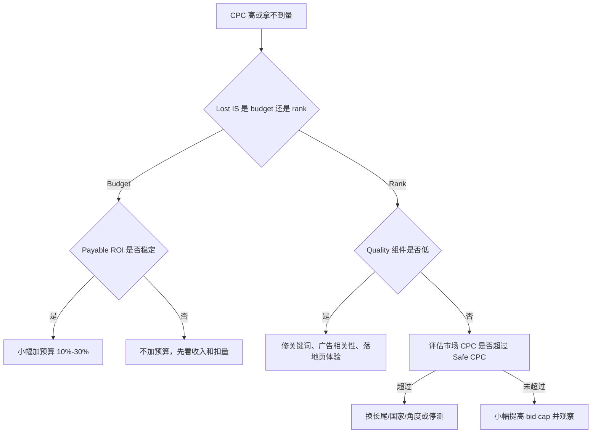

# Google Ads 竞价、Quality Score 与套利出价手册

更新时间：2026-06-08

本文解释 Google Ads 搜索广告竞价、Ad Rank、Quality Score、预算、出价策略和 Smart Bidding 在 Ads 套利里的真实意义。目标不是追求“质量分好看”，而是把买量 CPC、页面相关性、转化质量、回传延迟、扣量和可收回 ROI 放进同一套出价决策。本文不提供规避审核、操纵点击率、虚假转化、补点击、刷展示、模拟自然流量或绕过 Google Ads 系统的方案。

## 1. 竞价不是单纯价高者得

Google Ads 搜索广告每次有可展示机会时都会进入广告竞价。广告能否展示、展示在什么位置、实际 CPC 和广告资产是否出现，取决于多个因素，而不是只看出价。

可理解为：

```text
Auction eligibility
  -> Ad Rank evaluation
  -> Rank thresholds
  -> Position / asset eligibility
  -> Actual CPC
  -> Click / conversion / revenue feedback
```

套利团队关心的是：同样买一个点击，为什么某些关键词 CPC 高、曝光少、点击便宜但收入低、或预算花得很快。答案通常不在“账号玄学”，而在：

- 关键词意图和广告相关性。
- 页面体验和目的地质量。
- 竞品出价和市场密度。
- 出价策略是否适合当前样本。
- 转化数据是否真实、及时、可收款。
- 预算是否被过快消耗或限制。

## 2. Ad Rank 和实际 CPC

Ad Rank 是每次竞价中用来决定广告展示资格和位置的核心评估。Google Ads 帮助文档把 Ad Rank 影响因素概括为：

- 出价。
- 广告和落地页质量。
- Ad Rank thresholds。
- 竞价竞争度。
- 用户搜索上下文，例如地点、设备、搜索词、时间等。
- 广告资产和其他广告格式的预期影响。

这对套利团队意味着：

- 提高出价可以增加进入竞价和赢得位置的机会，但不保证盈利。
- 提高页面和广告相关性可以降低可赢得同类流量的有效成本。
- 低质量目的地可能让便宜点击变成低收入、高扣量和政策风险。
- 某些高商业意图词不是“出价不够”这么简单，可能需要更强页面证据和更高可收回 EPC。

实际 CPC 不是固定等于 max CPC。实际费用受下一位竞争者、Ad Rank thresholds 和竞价上下文影响。套利出价不能只看后台推荐 CPC，而要倒推：

```text
Max affordable CPC = Payable RPV * safety factor
Payable RPV = finalized_or_approved_revenue / paid_clicks
```

如果 `Max affordable CPC` 低于市场需要的有效 CPC，正确动作通常是换角度、换长尾、换国家、修页面或停测，而不是强行提高出价。

## 3. Quality Score 的正确用法

Quality Score 是 Google Ads Search campaign 里的诊断指标，主要由三部分组成：

- Expected CTR。
- Ad relevance。
- Landing page experience。

它不是每次竞价时的直接输入，也不是利润 KPI。它的价值是定位问题层级：

| Quality Score 组件 | 低分通常说明 | 套利修复方向 |
| --- | --- | --- |
| Expected CTR | 查询和广告吸引力弱，或历史点击表现差 | 重写标题、匹配意图、拆 ad group |
| Ad relevance | 关键词、广告文案和搜索词不匹配 | 按意图拆组，减少泛词，补 RSA 资产 |
| Landing page experience | 页面相关性、速度、透明度或可用性弱 | 修页面内容、速度、披露、导航和移动端体验 |

常见误区：

- 误区一：质量分高就一定赚钱。实际还要看 CPC、RPV、扣量和回款。
- 误区二：质量分低只要提高出价。实际可能是页面或关键词意图错了。
- 误区三：为了 CTR 写夸张标题。短期 CTR 可能变高，长期 RPV、lead quality、拒付和政策风险会变差。
- 误区四：把内部 landing score 当 Google Quality Score。内部评分只是上线前审计，不等于 Google 官方分数。

## 4. Impression Share、Budget 和 Rank

Search impression share 可以帮助判断“没拿到量”是预算问题还是排名/竞价问题。

| 信号 | 可能含义 | 动作 |
| --- | --- | --- |
| Lost IS budget 高，ROI/payable RPV 稳定 | 预算限制了可盈利流量 | 小幅加预算，保留硬止损 |
| Lost IS rank 高，CPC 接近上限 | 出价或质量不足 | 先修相关性和页面，再评估是否提高出价 |
| Lost IS rank 高，Quality 组件低 | 不是单纯预算问题 | 拆关键词、改广告、修 landing |
| IS 高但 ROI 差 | 已经买到量但质量差 | 降预算、否定词、换页面或停测 |

套利团队不应该盲目追求 100% impression share。只有当 payable ROI 稳定、扣量可解释、现金流可承受时，才值得争取更多份额。

## 5. 预算和 Overdelivery

Google Ads 平均日预算不是硬性日花费上限。Google Ads 帮助文档说明，系统可能在高流量日产生 overdelivery，并用月度计费限制约束总额。套利团队因此必须维护平台外部硬止损：

```text
Internal daily hard stop = min(platform_budget * 1.2, test_budget_remaining)
Test hard stop = planned_sample_clicks * expected_cpc * 1.2
Cash hard stop = available_cash - settlement_risk_buffer
```

预算设计原则：

- 冷启动预算服务于样本，不服务于规模。
- 日预算要小于团队愿意当天损失的金额。
- 回款周期长、扣量不明、lead quality 未验证时，预算更保守。
- 加预算前先看 payable/approved revenue，而不是只看 reported revenue。

## 6. 出价策略选择

| 阶段 | 推荐策略 | 原因 |
| --- | --- | --- |
| 冷启动无转化 | Manual CPC 或 Maximize Clicks with cap | 控制 CPC，买初始样本 |
| 有点击但追踪未稳 | Manual CPC / capped clicks | 先修 tracking 和页面 |
| 有稳定真实转化 | Maximize Conversions | 让系统寻找更多转化机会 |
| 有批准收入/价值 | Target CPA / Target ROAS | 用可收回价值指导自动出价 |
| 高扣量/长延迟 | 谨慎使用 Smart Bidding | 系统可能优化到 pending 或低质量转化 |

套利业务里的关键问题是：Google Ads 的 conversion 不一定等于可收款收入。比如：

- 表单提交后 buyer 拒付。
- AdSense estimated revenue 后续扣减。
- CPA pending conversion 最终 rejected。
- 转化回传延迟导致短期算法学错。
- 低质量 lead 数量多但 paid revenue 低。

因此，Smart Bidding 的前提不是“有 conversion action”，而是这个 conversion action 是否代表团队真正想买的可收回价值。

## 7. Smart Bidding 的套利风险

Smart Bidding 使用竞价时信号和转化数据优化 conversion 或 conversion value。它适合数据质量高的业务，但套利场景常见风险是“优化目标错位”。

风险场景：

| 场景 | 问题 |
| --- | --- |
| 用 submitted lead 做 primary conversion | 系统会买更多低质量表单 |
| 用 reported revenue 做 value | 扣量后 ROI 低于系统学习目标 |
| 不导入 offline qualified/paid conversion | 系统看不到 buyer quality |
| 广泛匹配 + 低样本智能出价 | 容易快速探索并烧预算 |
| 频繁改目标 CPA/ROAS | 学习期不稳定，难以复盘 |
| 多 Offer 混在一个 campaign | 不同 payout、扣量、延迟被混成平均值 |

安全做法：

- Primary conversion 尽量接近 approved/qualified/paid。
- 对 pending 和 submitted 使用 secondary 或观察口径。
- 导入 offline conversions 或至少导入 approved revenue CSV 做复盘。
- Campaign 按国家、垂类、Offer、页面和质量周期隔离。
- 目标 CPA/ROAS 以可收回利润倒推，不以平台建议直接套用。

## 8. 套利出价公式

### 8.1 内容/展示广告套利

```text
Payable RPV = finalized revenue / paid clicks
Safe CPC = Payable RPV * safety factor
Bid ceiling = min(Safe CPC, cashflow ceiling, test ceiling)
```

### 8.2 CPA/CPL 套利

```text
Approved EPC = approval_rate * CVR * payout
Paid EPC = paid_rate * Approved EPC
Safe CPC = Paid EPC * safety factor
```

### 8.3 Search/feed 套利

```text
Search RPV = search_action_rate * ad_ctr * rpc * (1 - deduction_rate)
Safe CPC = Search RPV * safety factor
```

安全系数建议：

| 阶段 | 安全系数 |
| --- | --- |
| 新 Offer / 新页面 / 新国家 | 0.35 - 0.55 |
| 有 3-7 天数据但未结算 | 0.50 - 0.70 |
| 已过一次结算周期 | 0.65 - 0.85 |
| 长期稳定且扣量低 | 0.75 - 0.90 |

## 9. 优化决策树



## 10. Optimization Score 和 Recommendations

Optimization score 和 recommendations 可以作为诊断输入，但不能替代套利利润模型。

可参考：

- 缺少资产。
- 预算受限。
- 否定词或关键词机会。
- Bid strategy 目标设置异常。
- 转化跟踪问题。

必须人审：

- 自动提高预算。
- 自动切换 Smart Bidding。
- 自动扩大 broad match。
- 自动应用不适合 Offer 条款的关键词。
- 自动新增可能触发敏感垂类或误导承诺的素材。

套利团队的最终目标不是 optimization score，而是：

```text
payable profit > 0
deduction explainable
policy risk acceptable
cashflow survivable
```

## 11. 系统落地

当前系统已经支持：

| 业务动作 | 系统位置 |
| --- | --- |
| 记录 campaign budget 和 bid strategy | `/campaigns` |
| 用 CPC、CVR、revenue、ROI 做测算 | `/calculators`、`/metrics/import` |
| 通过落地页审计发现页面体验风险 | Offer 详情页落地页采集 |
| 对 ROI、CPC、CTR、RPV 生成优化建议 | `/optimization` |
| 导出 Google Ads Editor CSV 和 Scripts JSON | `/campaigns` |
| 记录高风险建议和来源 URL | `/risk-audits`、`/sources` |

后续可扩展但仍安全的能力：

- `auction_metrics_daily`：search_impression_share、lost_is_budget、lost_is_rank、top_impression_share。
- `quality_diagnostics`：expected_ctr_status、ad_relevance_status、landing_page_experience_status。
- `bid_decision_log`：old_bid、new_bid、safe_cpc、payable_rpv、reason、reviewer。
- `conversion_quality_import`：submitted、approved、paid、rejected revenue。

不做：

- 不伪造点击率。
- 不制造虚假转化。
- 不补点击或刷展示来影响学习。
- 不用 Cookie 后台自动改价。
- 不自动应用高风险 recommendations。
- 不用 cloaking 或换号处理低质量流量。

## 12. 信息来源 URL

- Google Ads Help, How the Google Ads auction works: https://support.google.com/google-ads/answer/6366577
- Google Ads Help, About Quality Score for Search campaigns: https://support.google.com/google-ads/answer/6167118
- Google Ads Help, Determine a bid strategy based on your goals: https://support.google.com/google-ads/answer/2472725
- Google Ads Help, About automated bidding: https://support.google.com/google-ads/answer/2979071
- Google Ads Help, About Smart Bidding: https://support.google.com/google-ads/answer/7065882
- Google Ads Help, Google Ads automated bidding: https://support.google.com/google-ads/answer/10964872
- Google Ads Help, About overdelivery and your average daily budget: https://support.google.com/google-ads/answer/1704443
- Google Ads Help, Optimization score: https://support.google.com/google-ads/answer/9061547
- Google Ads Help, Types of recommendations: https://support.google.com/google-ads/answer/3416396
- Google Ads API, Bidding strategy types: https://developers.google.com/google-ads/api/docs/campaigns/bidding/strategy-types
- Google Ads API, Upload offline conversions: https://developers.google.com/google-ads/api/docs/conversions/upload-offline
- Google Ads Help, About conversion lag reporting: https://support.google.com/google-ads/answer/9347141
